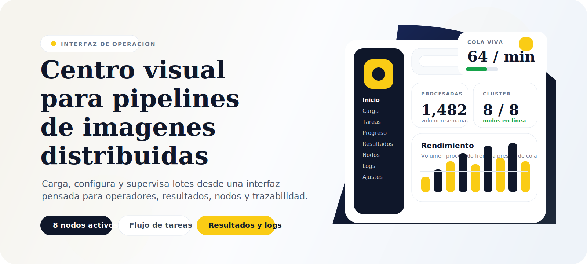
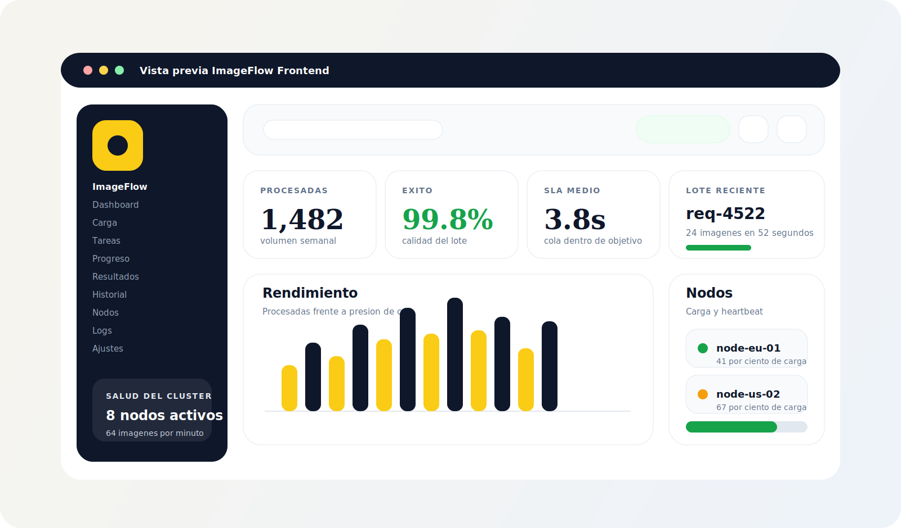
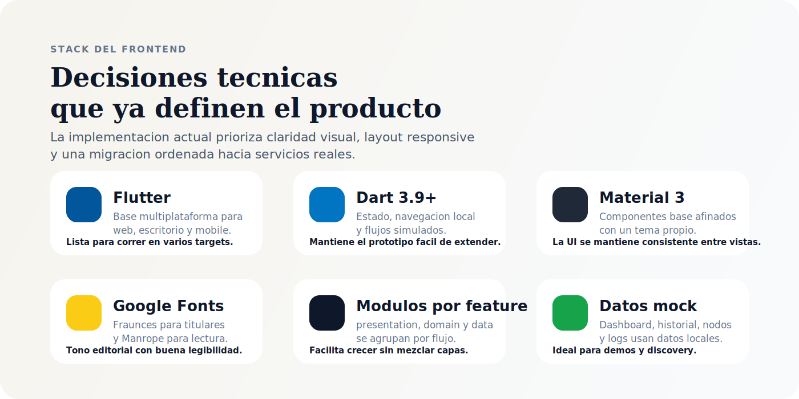
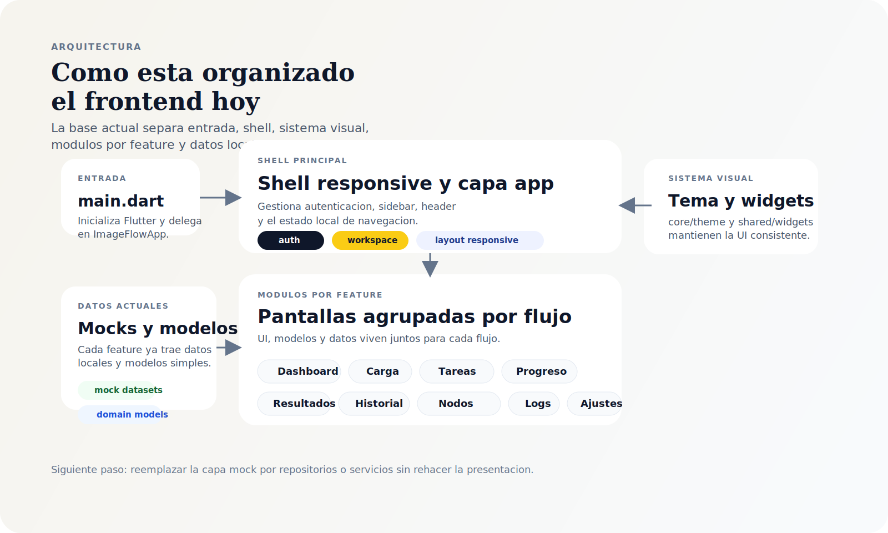

<p align="center">
  
</p>

<p align="center">
  
  
  
  
</p>

<h1 align="center">ImageFlow Frontend - Edit Test</h1>

<p align="center">
  Interfaz Flutter para supervisar, configurar y recorrer un flujo distribuido de procesamiento de imagenes.
</p>

<p align="center">
  El repositorio contiene un frontend visualmente pulido para autenticacion, carga de lotes, configuracion de tareas, seguimiento de progreso, revision de resultados y observabilidad operativa.
</p>

<p align="center">
  <a href="#resumen">Resumen</a> |
  <a href="#demo">Demo</a> |
  <a href="#stack">Stack</a> |
  <a href="#arquitectura">Arquitectura</a> |
  <a href="#estructura-del-proyecto">Estructura</a> |
  <a href="#puesta-en-marcha">Puesta en marcha</a>
</p>

<p align="center">
  
</p>

## Resumen

`ImageFlow Frontend` vive en `flutter_app/` y modela la experiencia de un operador que trabaja con un pipeline distribuido de imagenes. El recorrido principal ya esta representado: iniciar sesion, cargar archivos, definir transformaciones, monitorear la ejecucion, revisar resultados y consultar historial, nodos y logs.

## Demo

<p align="center">
  
</p>

Vista ilustrativa del panel principal y del estado operativo de la interfaz.

## Indice

- [Por que importa](#por-que-importa)
- [Pantallas principales](#pantallas-principales)
- [Stack](#stack)
- [Arquitectura](#arquitectura)
- [Estructura del proyecto](#estructura-del-proyecto)
- [Puesta en marcha](#puesta-en-marcha)
- [Variables de entorno](#variables-de-entorno)
- [Comandos utiles](#comandos-utiles)
- [Flujo actual](#flujo-actual)

## Por que importa

- Presenta el recorrido completo de operacion del producto.
- Define una direccion visual consistente con layout responsive, tipografia editorial y componentes reutilizables.
- Deja una base clara para seguir evolucionando el frontend sin rehacer toda la presentacion.

## Pantallas principales

- `Auth`: login, registro y recuperacion de contrasena por pasos.
- `Dashboard`: throughput, cola, lotes recientes y salud del cluster.
- `Upload`: carga de imagenes por lote.
- `Task Builder`: configuracion de transformaciones, preview y salida.
- `Progress`: seguimiento de procesamiento distribuido.
- `Results`: metricas, comparacion antes/despues y grilla de resultados.
- `History`: historial de solicitudes con filtros y acceso a detalle.
- `Request Detail`: detalle por solicitud, transformaciones y logs asociados.
- `Worker Nodes`: monitoreo de nodos, carga y heartbeat.
- `Logs`: eventos operativos por nivel y fuente.
- `Settings`: perfil, notificaciones, defaults y acceso API.

## Stack

<p align="center">
  
</p>

- `Flutter` como shell multiplataforma.
- `Dart` para logica de UI, estado y modulos.
- `Material 3` como base de componentes, personalizado por tema propio.
- `google_fonts` para la combinacion tipografica `Fraunces` + `Manrope`.
- Estructura por features con carpetas `presentation`, `domain` y `data`.
- Capa de datos local para dashboard, historial, nodos, logs, detalle y resultados.

## Arquitectura

<p align="center">
  
</p>

- La estructura sigue un enfoque de `Screaming Architecture`: las carpetas principales expresan capacidades del producto como `auth`, `dashboard`, `upload`, `progress`, `results`, `history`, `nodes` o `settings`.
- `lib/main.dart` inicia Flutter y delega en `ImageFlowApp`.
- `lib/features/shell/presentation/shell.dart` concentra autenticacion, navegacion y layout responsive.
- `lib/core/theme/app_theme.dart` define colores, tipografia y estilo global.
- `lib/shared/widgets/shared_widgets.dart` agrupa primitivas reutilizables como paneles, pills, grids y metric cards.
- Cada feature mantiene cerca su UI, modelos y datos para que el crecimiento sea mas ordenado.
- La informacion de cada vista se organiza localmente dentro del frontend.

## Estructura del proyecto

```text
Frontend/
|-- assets/                      # SVG usados por este README
`-- flutter_app/
    |-- lib/
    |   |-- app.dart
    |   |-- main.dart
    |   |-- core/
    |   |   `-- theme/
    |   |-- shared/
    |   |   `-- widgets/
    |   `-- features/
    |       |-- auth/
    |       |-- dashboard/
    |       |-- history/
    |       |-- logs/
    |       |-- nodes/
    |       |-- progress/
    |       |-- request_detail/
    |       |-- results/
    |       |-- settings/
    |       |-- shell/
    |       |-- task_builder/
    |       `-- upload/
    |-- android/
    |-- ios/
    |-- linux/
    |-- macos/
    |-- web/
    `-- windows/
```

## Puesta en marcha

### Requisitos

- Flutter SDK instalado correctamente.
- Un dispositivo, emulador o navegador disponible.
- `flutter doctor` en buen estado para la plataforma que vayas a usar.

### Instalacion y ejecucion

```bash
cd flutter_app
flutter pub get
flutter run -d chrome
```

Si prefieres escritorio en Windows:

```bash
cd flutter_app
flutter run -d windows
```

## Variables de entorno

No se requieren variables de entorno para recorrer la interfaz en su estado actual.

## Comandos utiles

- `flutter pub get` instala dependencias.
- `flutter run` levanta la app en el target por defecto.
- `flutter analyze` ejecuta analisis estatico.
- `flutter build web` genera una build web.
- `flutter build windows` genera una build de escritorio para Windows.

## Flujo actual

1. El usuario entra por la capa de autenticacion.
2. Accede al shell principal y revisa el estado del sistema.
3. Carga un lote de imagenes y pasa al configurador de tareas.
4. Define transformaciones, formato de salida y parametros de calidad.
5. Inicia el procesamiento y observa el avance del lote.
6. Revisa resultados, historial, nodos y logs operativos.
